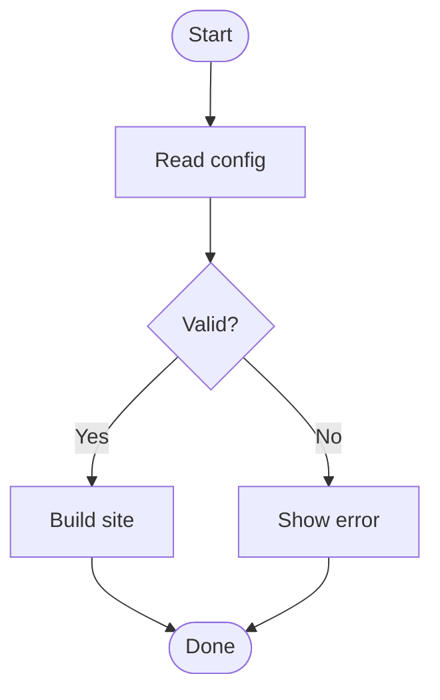
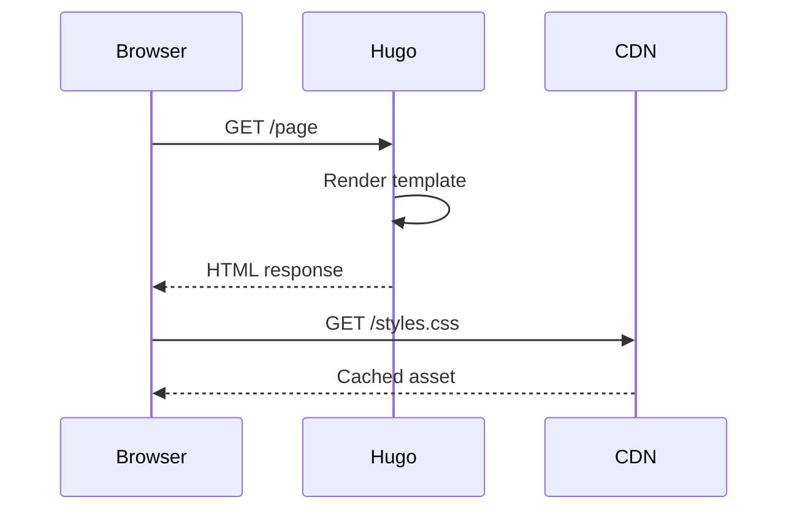
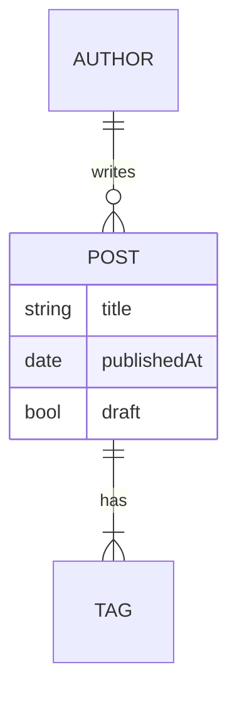

+++
title = "Code, Mermaid & Diagrams"
date = 2024-03-22T14:45:30Z
tags = ["programming", "code", "diagrams", "mermaid", "goat", "syntax-highlighting"]
description = "Syntax highlighting, Mermaid diagrams, and GoAT ASCII art."
+++

## Syntax Highlighting

### Go

```go
package main

import "fmt"

func fibonacci(n int) int {
	if n <= 1 {
		return n
	}
	return fibonacci(n-1) + fibonacci(n-2)
}

func main() {
	for i := range 10 {
		fmt.Printf("F(%d) = %d\n", i, fibonacci(i))
	}
}
```

### Python

```python
def quicksort(arr: list) -> list:
    if len(arr) <= 1:
        return arr
    pivot = arr[len(arr) // 2]
    left = [x for x in arr if x < pivot]
    mid  = [x for x in arr if x == pivot]
    right = [x for x in arr if x > pivot]
    return quicksort(left) + mid + quicksort(right)

print(quicksort([3, 6, 8, 10, 1, 2, 1]))
```

### Shell

```bash
#!/usr/bin/env bash
set -euo pipefail

for dir in */; do
  echo "Processing: $dir"
  hugo build --source "$dir" --destination "dist/${dir%/}"
done
```

---

## Mermaid Diagrams

### Flowchart



### Sequence Diagram



### Entity Relationship



---

## GoAT ASCII Diagrams

```goat
            ┌───────────┐
            │   Client  │
            └─────┬─────┘
                  │ HTTP
        ┌─────────▼──────────┐
        │    Load Balancer   │
        └──┬──────────────┬──┘
           │              │
   ┌───────▼───┐    ┌─────▼──────┐
   │  Server A │    │  Server B  │
   └───────────┘    └────────────┘
```

```goat
    0       1       2       3
    +-------+-------+-------+
    |       |       |       |
    |  A    |  B    |  C    |
    |       |       |       |
    +-------+-------+-------+
```
